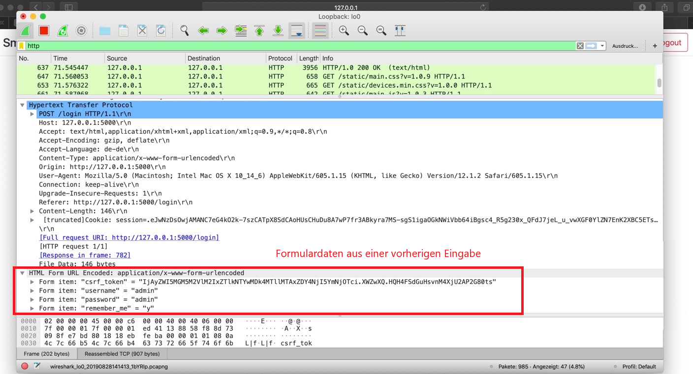
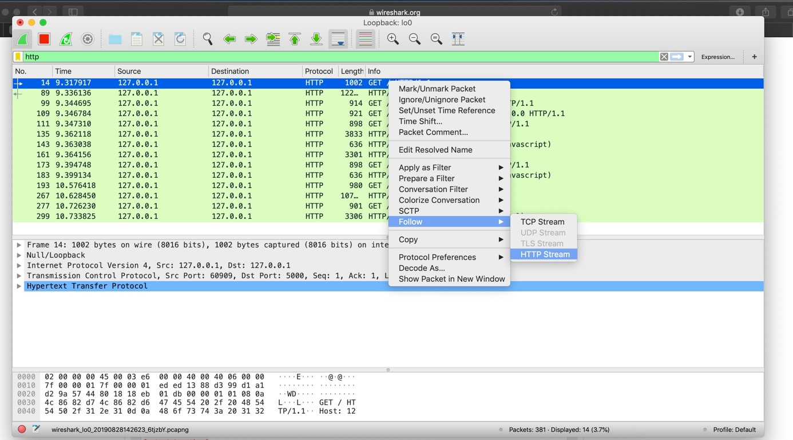
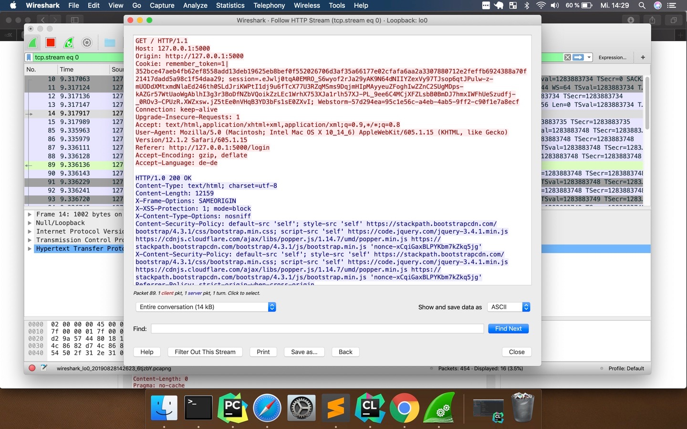
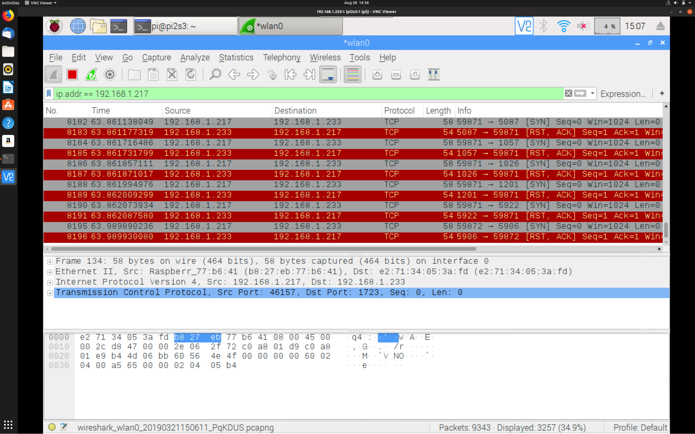
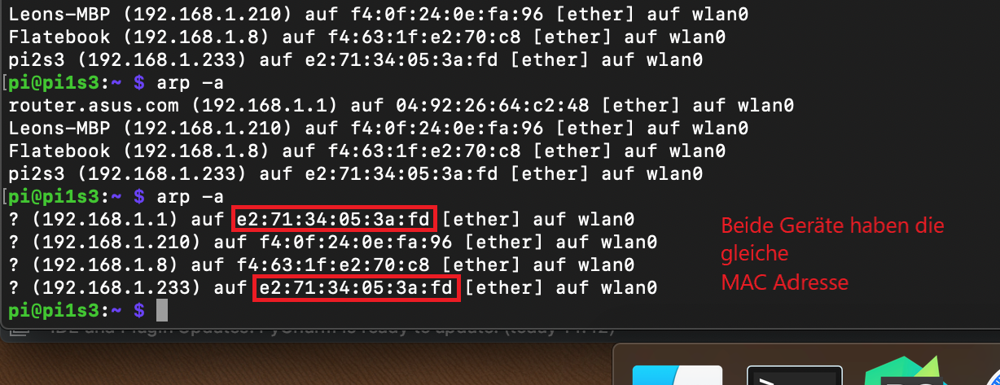
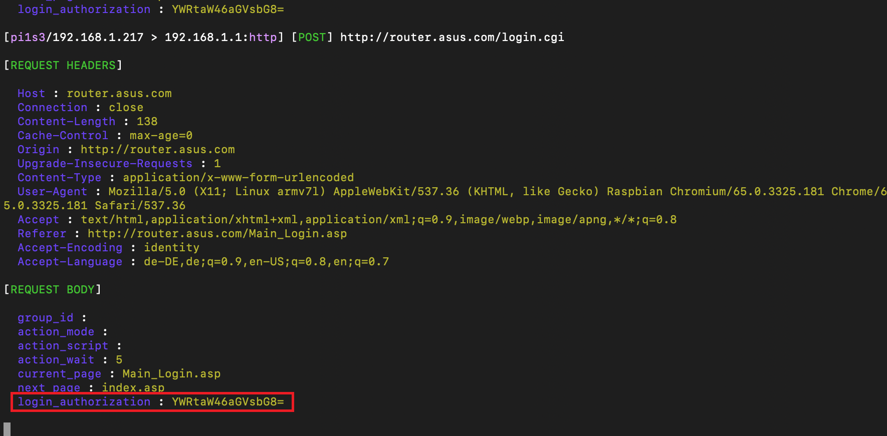
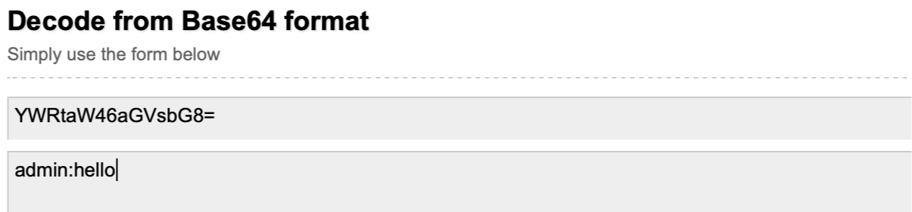

# Dokumentation Netzwerksicherheit
*Flavio Schröder (1108463) und Leon Richter (1105170)*
### Aufgaben mit den jeweiligen Antworten, sowie Erklärung des Vorgehens
***
## nmap

- **Starten Sie nmap und machen Sie sich mit der grundsätzlichen Funktionsweise vertraut.**

1. `ifconfig` laufen lassen, um die Subnetzmaske und IP-Adressbereich in Erfahrung zu bringen (192.168.1.1/24)

2. `sudo nmap -sS 192.168.1.1/24` scannt das gesamte Subnetz und alle Ports, 3 Geräte erhalten:

  1. Asus Router auf 192.168.1.1 | Port 53,80,9998
  2. Raspberry auf 192.168.1.217 | Port 22,5900
  3. unbekanntes Gerät auf 192.168.1.210 | Port none

- **Ermitteln Sie mit nmap, welche Dienste im Netzwerk zur Verfuegung stehen.**

1. dns
2. http Oberfläche auf dem Router
3. ssh und vnc auf dem Raspberry

- **Finden Sie das geheime Administrationspanel auf Pi1.**

1. Einloggen mit Virtueller Machine auf Pi1 via vnc
2. `netstat -pln` laufen lassen, listet alle Prozesse auf die auf Ports hören (unter anderem auch 62580)
3. localhost:62580 im Browser liefert das geheime Administrationspanel

- **Benutzen Sie die Option des Stealthscanning in nmap, um unter anderem Pi1 zu scannen und erklären Sie die Funktionsweise.**

1. `sudo nmap -sS 192.168.178.217` also für Raspberry 1
- Funktionsweise: SYN-Scanning, also Versenden von TCP SYN packets an jeden Port und testen, ob eine Antwort kommt. Wenn eine Antwort kommt, antwortet man mit RST Paket, um den Vorgang abzubrechen. (gleiches Ergebnis wie vorher)

- **Es gibt eine Option in nmap, um das Betriebssystem eines gescannten Rechners "zu erraten". Nutzen Sie diese, um das Betriebssystem auf Pi1 bzw. Ihrem Laptop zu ermitteln.**

1. `sudo nmap -sS -O 192.168.178.217` = stealth OS-detection ip (OS details: Linux 3.2 - 4.9)

- **Welche unterschiedlichen Scantypen unterstützt nmap und warum haben diese unterschiedliche Effizienz?**

1. `-sS` stealth Scanning, nutzt TCP SYN Scanning, schnell und unauffällig

2. `-sT` connect Scanning, gleich wie `-sS` nur dass nicht nmap das Paket baut sondern der Network Stack vom Rechner via syscall

3. `-sU` UDP-Scan, nutzt UDP, langsam weil stateless

4. `-sY` SCTP-init, nutzt sctp Services und ist das Äquivalent zum stealth scan

5. `-sN, -sF, -sX` TCP NULL, FIN, Xmas Nutzt eine Lücke im RFC793 aus, NULL sendet leeren Header, setzt das TCP FIN Bit, setzt alle Bits die man senden kann, also FIN, PSH und URG 

> **Effizienz**\
Generell ist das Stealth Scanning die unauffälligste und schnellste Lösung und deshalb  auch der Standard. NMAP ahmt einen normalen TCP Handshake nach und sendet ein SYN  Packet. Da dies jeder normale Client ebenfalls machen würde, ist diese Strategie wenig  auffällig. Da TCP stateful ist und keine Pakete verloren gehen, ist der Scan auch schnell.\
Die Alternative wäre der Connect Scan, den NMAP nutzen kann, wenn ohne  ausreichende Rechte gestartet wird. Das Programm baut dann nicht die Pakete selber,  sondern lässt dies den Network Stack des OS machen. Dies passiert über einen Syscall.\
Der UDP Scan hat den inherenten Nachteil, dass UDP stateless ist. Wenn keine Antwort  kommt, ist also nicht klar, ob das Paket verloren gegangen ist oder ob der Host down  ist. Darum sind ggf. wiederholte Anfragen notwendig und man wird langsamer.

***

## Wireshark

- **Filtern Sie die Aufzeichnungsdatei auf IP-Adressen und Ports**
1. Filtern nach keywords http oder ip.dst == TARGET-IP in der Leiste liefert uns den entsprechenden Stream

- **Vollziehen Sie unter anderem die eben getätigten Webseitenaufrufe nach. Können Sie Ihre Formulareingabe entdecken? Was ist der Unterschied zwischen den Aufrufen mit verschlüsselter bzw. unverschlüsselter Verbindung?**

1. Formulareingabe kann bei unverschlüsselter Verbindung ausgelesen werden, siehe Bild.

- Bei unverschlüsselter Verbindung kann man den http Traffic komplett lesen, bei verschlüsselter Verbindung (https) nur die verschlüsselten Daten, welche verschlüsselt über tls übertragen werden. Keine Auslese möglich.

- **Isolieren Sie einen Stream und erläutern Sie, was das ist.**
1. Verfolgung des Streams mit folgenden Optionen:

 
 
2. Im folgenden Bild das Ergebnis: rot = Client, blau = Server.\
Wir erhalten ein Streamprotokoll in chronologischer Reihenfolge die den Datenaustausch.

 
 
- **Loggen Sie sich von Ihrem Laptop aus per VNC/SSH auf Pi1 ein und führen Sie einen Stealthscan auf den Pi2 mit nmap aus. Zeichnen Sie währenddessen mit Wireshark den Datenverkehr des Pi2 auf und analysieren sie diesen, um den Scan dennoch ausfindig zu machen.**
1. Wir haben nach der ip von dem Raspberry 1 in wireshark gefiltert. Wireshark markiert RST Pakete und entsprechend fallen die vielen Anfragen in dem Stream auf, siehe Bild.\
Man kann auch sehen, wie jeder Port iterativ angefragt wird und das SYN Paket erhält.

***

## Bettercap

- **Aktivieren Sie den Sniffermodus und Verschaffen Sie sich das Passwort**

1. sniffermodus aktivieren mit `sudo bettercap -X`.\
bettercap versendet daraufhin manipulierte ARP messages an alle Clients im Netzwerk, in denen die MAC Adresse von dem Raspberry2 die des eigentlichen Routers überschreibt, siehe Bild. Die Clients aktualisieren daraufhin ihre ARP Table (sichtbar mit `arp -a`)

 
 
2. Wenn die gespoofte Seite aufgerufen wird (in unserem Fall 192.168.1.1), wird das Paket an das falsche Gerät, in unserem Fall an den Raspberry geschickt. Bettercap loggt die Dateien in einer .pcapng Datei, welche mit wireshark geöffnet werden kann.

3. Wir filtern nach http und der Zieladresse und suchen ein POST-Request. In diesem sehen wir die Nutzername-Passwort Kombination base64 encoded im Klartext. Decodiert erhalten wir dann den Nutzernamen und das passwort, siehe Bilder.

 
 
4. Nur noch einmal schnell entschlüsseln:

- **Schreiben Sie ein Bettercap TCP Proxy Modul, welches die aufgerufene URL von HTTP-Anfragen auf der Konsole ausgibt (TCP Proxy Funktion von Bettercap verwenden)**

- **Jeder Versuch, eine Website aufzurufen, soll dazu führen dass im Quelltext der angegebenen Seite ein eigenes javascript ausgeführt wird. Schreiben Sie ein Bettercap Modul basierend auf dem HTTP Proxy Modul für diesen Zweck.**

- **Nutzen Sie Bettercap um Folgendes zu erreichen: Beim Aufruf einer bestimmten Webseite auf dem Laptop soll eine andere ausgeliefert werden.**

- **Stellen Sie anschließend den Ausgangszustand des Netzwerkes wieder her.**

***

## Drahtlose Netzwerke

- **Warum funktioniert die Überwachung eines bestimmten Rechners nur, wenn dieser sich neu mit dem Netzwerk verbindet oder einige Zeit abgewartet wurde?**

- **Kann man eine Neuverbindung des Zielrechners mit dem Netzwerk erzwingen?**

- **Welche Unterschiede sind bei verschlüsselten und unverschlüsselten Verbindungen im überwachten Datenverkehr zu beobachten?**